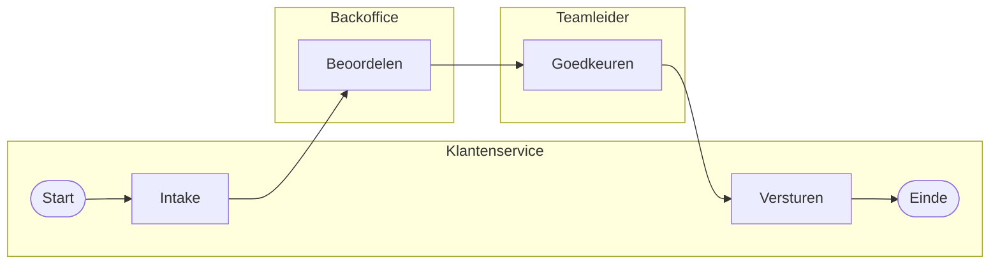

# Proces met rollen

Dit proces staat in een Markdown-bestand.

```mermaid
flowchart LR
  subgraph ks [Klantenservice]
    S([Start]) --> I[Intake]
    V[Versturen] --> E([Einde])
  end
  subgraph bo [Backoffice]
    B["Beoordelen"]
  end
  subgraph tl [Teamleider]
    G[Goedkeuren]
  end
  I --> B --> G --> V
```
